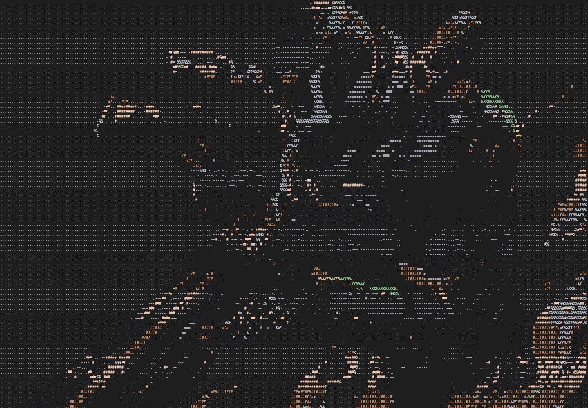
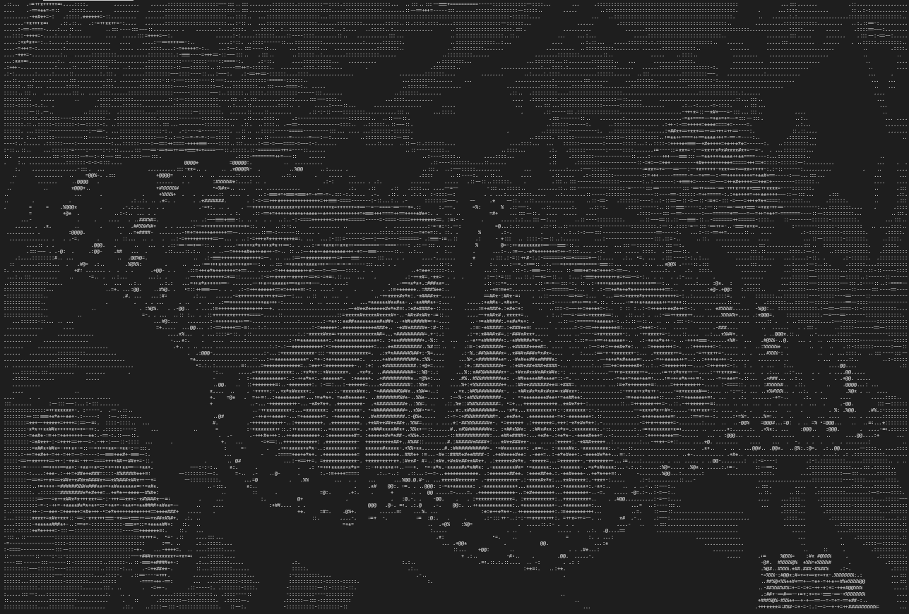
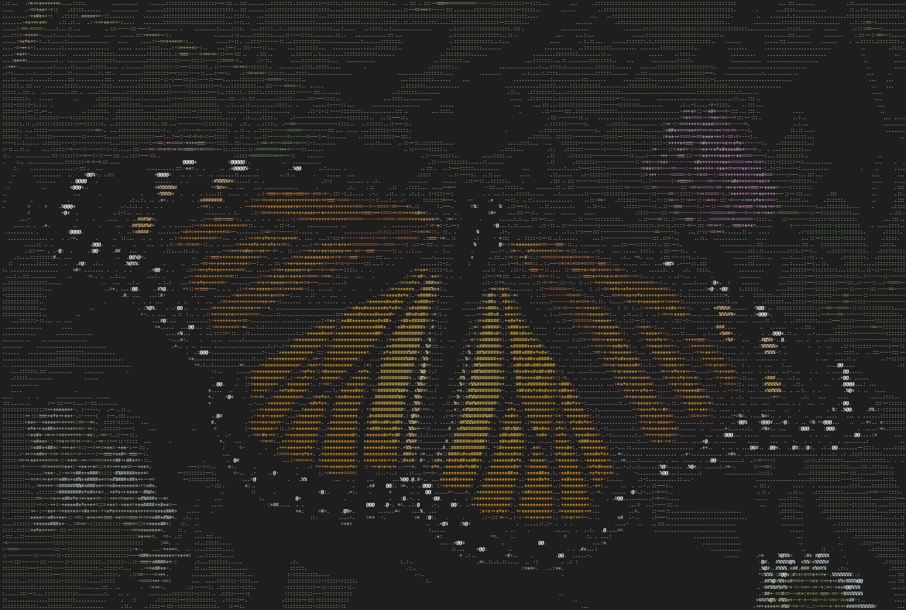
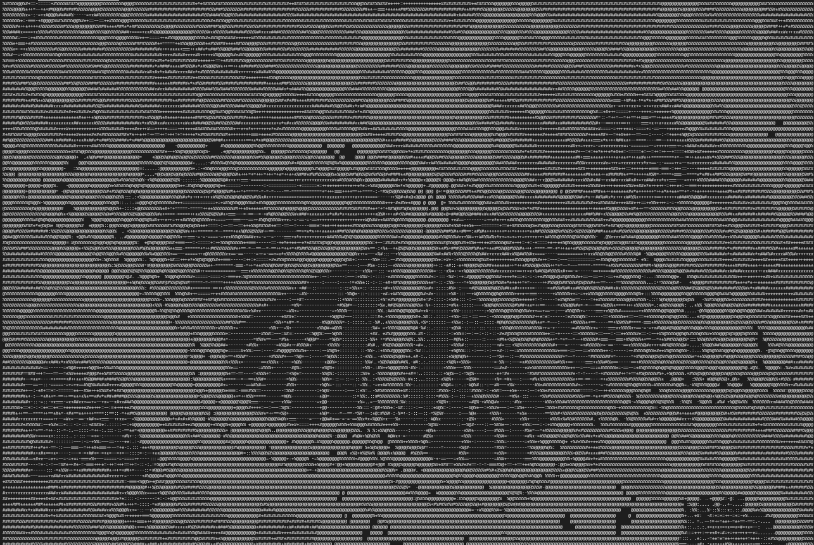
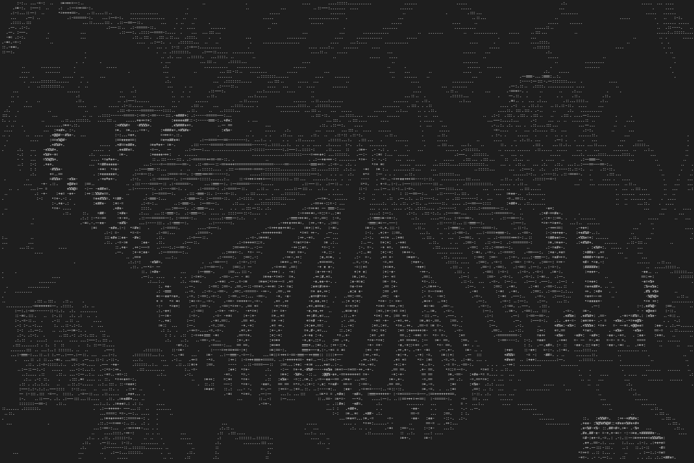

<h1 align="center">pixcii</h1>

<p align="center">
A feature-rich media-to-ASCII converter written in C++
</p>

<div align="center">


</div>

---

## Features

- Convert **media files to ASCII art** with **customizable character sets**
- **Real-time video playback** with smooth frame-by-frame ASCII conversion
- **Auto-fit by default** to terminal size for optimal viewing experience
- Supports **grayscale** and **ANSI-colored** output for all media types
- Adjustable **brightness**, **scaling**, and **aspect ratio** correction
- **Edge detection** using the **Sobel filter** for enhanced details
- Option to **invert brightness** for different visual effects
- **Automatic frame rate detection** and matching for smooth video playback
- **Efficient** media handling with optimized terminal rendering
- **Utilizes** `stb_image` libraries for robust **media loading** and **OpenCV** for video processing

## Installation

### Prerequisites

Ensure you have the following installed:

- **C++17** or later
- **CMake** (>= 3.10)
- **OpenCV** (>= 4.0) for video and GIF support
- `stb_image.h`, `stb_image_write.h`, and `stb_image_resize2.h` (already included)

#### Installing OpenCV

```bash
# Ubuntu/Debian
sudo apt-get install libopencv-dev

# macOS (with Homebrew)
brew install opencv

# Windows (with vcpkg)
vcpkg install opencv
```

### Build Instructions

```bash
# Clone the repository
git clone https://github.com/ashish0kumar/pixcii.git
cd pixcii

# Quick build (recommended)
chmod +x build.sh
./build.sh

# Or manual build
mkdir build && cd build
cmake ..
make -j$(nproc)

# Run the program
./build/pixcii --help
```

#### Move to a Directory in `$PATH`

```bash
mv build/pixcii ~/.local/bin/

# If ~/.local/bin/ is not in `$PATH:
export PATH="$HOME/.local/bin:$PATH"

# Usage
pixcii --help
```

## Usage

### Command-Line Options

| Option                       | Description                                                   |
| ---------------------------- | ------------------------------------------------------------- |
| `-i, --input <path>`         | Path to input media file (required)                          |
| `-o, --output <path>`        | Path to save output ASCII art (optional)                     |
| `-c, --color`                | Enable colored ASCII output using ANSI escape codes          |
| `-g, --original`             | Display media at original resolution                         |
| `-s, --scale <float>`        | Scale media (default: 1.0) (ignored unless --original is used) |
| `-a, --aspect-ratio <float>` | Adjust character aspect ratio (default: 2.0)                 |
| `-b, --brightness <float>`   | Adjust brightness multiplier (default: 1.0)                  |
| `-n, --invert`               | Invert brightness levels                                      |
| `-e, --edges`                | Use edge detection for ASCII conversion                      |
| `-m, --chars <string>`       | Custom ASCII character set (default: " .:-=+*#%@")           |
| `-d, --delay <ms>`           | Frame delay for videos in milliseconds (default: auto)      |
| `-h, --help`                 | Show help message                                             |

### Supported Formats

**Images:** JPG, PNG, BMP, TGA, GIF (static)  
**Videos:** MP4, AVI, MOV, MKV, WEBM, M4V, WMV, FLV  
**Animated:** GIF

### Example Commands

#### Basic Usage

```bash
# Convert image
pixcii -i image.jpg

# Video playback with color
pixcii -i video.mp4 -c

# GIF with edge detection
pixcii -i animation.gif -e
```

#### Original Size Mode

```bash
# Display at original resolution
pixcii -i image.jpg -g

# Original size with scaling
pixcii -i large_image.png -g -s 0.5

# Save ASCII art to file
pixcii -i image.jpg -o artwork.txt
```

#### Advanced Usage

```bash
# Edge detection with color and brightness adjustment
pixcii -i image.jpg -e -c -b 1.5

# Custom frame delay for videos
pixcii -i video.mp4 -d 150

# Custom character set
pixcii -i video.mp4 -m " .:-=+*#%@" -c
```

### Video Playback Controls

- **`Ctrl+C`** - Stop video playback and exit
- **Terminal zoom** (`Ctrl +/-`) - Adjust display size during playback
- Videos automatically match original frame rate for smooth playback

### Example Outputs

| Normal Output                | Colored Output             |
| ---------------------------- | -------------------------- |
|  |  |

| Negative Output               | Edge Detection Output    |
| ----------------------------- | ------------------------ |
|  |  |

## Roadmap

- [x] Automatically detect the terminal size and scale the output to fit
- [x] Media support with real-time playback
- [x] Auto-fit by default with original size option
- [ ] Implement different character sets optimized for different scenarios
- [ ] Allow users to save and load parameter presets via config files
- [ ] Performance optimizations for high-resolution media
- [ ] Export ASCII animations to various formats

## Contributions

Contributions are welcome! If you'd like to improve the project, follow these
steps:

1. Fork the repository.
2. Create a new branch for your feature or bug fix.
3. Commit your changes with a clear message.
4. Push your branch and create a pull request.

Before submitting, ensure your code follows the project's coding style and is
well documented.

<br>

<p align="center">
	
</p>

<p align="center">
        <i><code>&copy 2025-present <a href="https://github.com/ashish0kumar">Ashish Kumar</a></code></i>
</p>

<div align="center">
<a href="https://github.com/ashish0kumar/pixcii/blob/main/LICENSE"></a>&nbsp;&nbsp;
</div>
