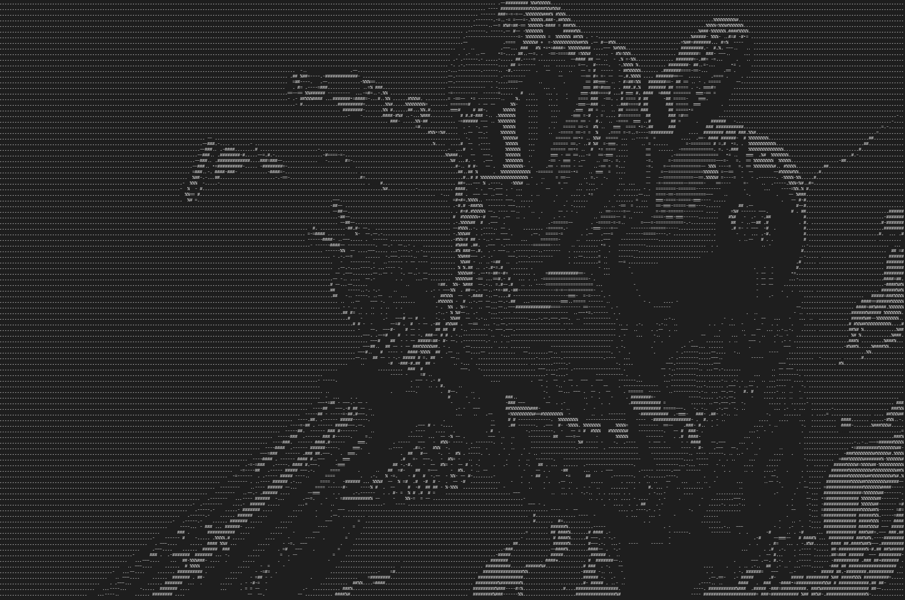

# pixcii

A fast and feature-rich **image-to-ASCII** converter written in **C++**



## Features

- Convert **images to ASCII art** with **customizable character sets**
- Supports **grayscale** and **ANSI-colored** output
- **Fast** processing with **efficient** image handling
- Adjustable **brightness**, **scaling**, and **aspect ratio** correction
- **Edge detection** using the **Sobel filter** for enhanced details
- Option to **invert brightnes**s for different visual effects

## Installation

### Prerequisites

Ensure you have the following installed:

- **C++11** or later
- **CMake** (>= 3.10)
- `stb_image.h` and `stb_image_write.h` (already included)

### Build Instructions

```sh
# Clone the repository
git clone https://github.com/ashish0kumar/pixcii.git
cd pixcii

# Create a build directory
mkdir build && cd build

# Configure and compile
cmake ..
make

# Run the program
./pixcii --help
```

## Usage

> [!NOTE]
> You **may need to zoom in or out** in your terminal (`Ctrl +/-`) to **properly view the ASCII art**, as character spacing and aspect ratio can affect readability.

### Command-Line Options

| Option                       | Description                                                   |
| ---------------------------- | ------------------------------------------------------------- |
| `-i, --input <path>`         | Path to the input image (required)                            |
| `-o, --output <path>`        | Path to save output ASCII art (optional)                      |
| `-m, --chars <string>`       | Custom ASCII character set (default: " .:-=+*#%@")            |
| `-c, --color`                | Enable colored ASCII output using ANSI escape codes           |
| `-n, --invert`               | Invert brightness levels                                      |
| `-b, --brightness <float>`   | Adjust brightness multiplier (default: 1.0)                   |
| `-s, --scale <float>`        | Resize image before conversion (default: 1.0)                 |
| `-e, --edges`                | Use edge detection instead of brightness for ASCII conversion |
| `-a, --aspect-ratio <float>` | Adjust character aspect ratio (default: 2.0)                  |
| `-h, --help`                 | Show help message                                             |

### Example Commands

- **Convert an image to ASCII art and save to a file**

  ```sh
  ./pixcii -i input.jpg -o output.txt
  ```

- **Use a custom ASCII character set**

  ```sh
  ./pixcii -i input.jpg -m " .:-=+*#%@"
  ```

- **Enable colored ASCII output**

  ```sh
  ./pixcii -i input.jpg -c
  ```

- **Invert brightness levels**

  ```sh
  ./pixcii -i input.jpg -n
  ```

- **Adjust brightness multiplier**

  ```sh
  ./pixcii -i input.jpg -b 1.5
  ```

- **Resize image before conversion**

  ```sh
  ./pixcii -i input.jpg -s 0.8
  ```

- **Use edge detection**

  ```sh
  ./pixcii -i input.jpg -e
  ```

- **Adjust character aspect ratio**

  ```sh
  ./pixcii -i input.jpg -a 3.0
  ```

- **Show help message**

  ```sh
  ./pixcii -h
  ```

### Example Outputs

| Normal Output | Colored Output |
|--------------|---------------|
|  |  |

| Negative Output | Edge Detection Output |
|----------------|----------------------|
|  |  |

## Roadmap

- [ ] Automatically detect the terminal size and scale the output to fit.
- [ ] Implement different character sets optimized for different scenarios (one for density, one for clarity, etc)
- [ ] Allow users to save and load parameter presets via config files.
- [ ] Optimize performance for larger images
- [ ] Video support

## Contributions

Contributions are welcome! If you'd like to improve the project, follow these steps:

1. Fork the repository.
2. Create a new branch for your feature or bug fix.
3. Commit your changes with a clear message.
4. Push your branch and create a pull request.

Before submitting, ensure your code follows the project's coding style and is well documented.

## License

[MIT](LICENSE)